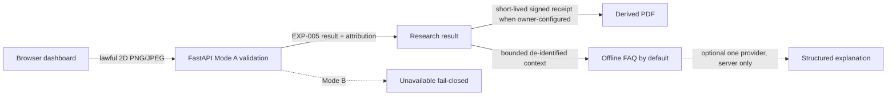

# NeuroInsight AI

NeuroInsight AI is a **non-clinical academic demonstration** of explainable 2D brain-MRI image classification. The live dashboard is <https://neuroaiapp-gtbxy6cw.manus.space>.

> **This system is not a medical diagnosis and must not replace a qualified radiologist.**

## What is available

Mode A performs real experimental four-class 2D classification—glioma, meningioma, pituitary tumour, or no tumour—using the deployed EXP-005 ResNet50 head-only model. The earlier owner-approved public recovery release verified a validation-calibrated model-confidence score, low-confidence/manual-review state, genuine Grad-CAM attribution, and a derived academic PDF. In the current PR, a PDF additionally requires a server-issued signed receipt and owner-configured signing secret; without it, the branch makes report saving unavailable rather than fabricating a download. With explicit consent on the earlier release, a signed-in user may save only account-linked pseudonymous result metadata and derived Mode A PDF/Grad-CAM artifacts; original uploads are not stored by default, and each re-download receives a fresh ownership-checked URL.

The current branch rejects obviously incompatible inputs before inference using a conservative grayscale, intensity-structure, dark-border, dimension, and pixel-budget screen. This prevents blank and strongly chromatic non-MRI images from receiving a tumour class, but it is not a trained MRI-modality or out-of-distribution detector. Passing the screen does not prove that an image is an MRI or that a result is medically meaningful.

On the audited BDNeuro-MRI v7 fixed image-level test split, EXP-005 recorded accuracy `0.8099`, macro-F1 `0.8080`, and weighted-F1 `0.8110`. These are experimental image-level results only, not patient-level, external, clinical, diagnostic, or medical-probability evidence.

### Optional research explanation

The **Research Explanation Assistant** explains the experimental result’s research scope, confidence/calibration, abstention, Grad-CAM limitations, methodology, report behavior, and Mode B unavailability in English or Hindi. It is not a medical advisor and cannot change any model output. The shipped configuration uses the deterministic offline FAQ. An owner may later configure **one** server-side OpenAI *or* Gemini provider, but only after the privacy and manual-gate review in [`docs/RESEARCH_ASSISTANT_TECHNICAL_NOTE.md`](docs/RESEARCH_ASSISTANT_TECHNICAL_NOTE.md); browser code never receives a provider key or imaging payload.

## Deployment status and safe demo workflow

| Surface | Status | Commit relationship |
|---|---|---|
| Public dashboard | <https://neuroaiapp-gtbxy6cw.manus.space> | Earlier owner-approved recovery checkpoint `409f8a70`; it is **not** the live version of PR #1. |
| Stable inference API | `main` deployment | Remains tied to `main` checkpoint `26498b5`; do not treat it as the feature-branch preview. |
| PR #1 inference preview | Vercel Git deployment shown in PR checks | Non-production, commit-specific, and subject to redeployment; it is not a public dashboard promotion. |



For a lawful demonstration, use only a locally held, authorised PNG/JPEG outside any locked evaluation split; acknowledge the data-use notice, submit it to **Mode A**, and interpret the output only as experimental image-level research context. Do not upload personal, restricted, DICOM, NIfTI, or test-split data. Current analysis state—including filename, derived Grad-CAM, and report receipt—is memory-only and is not written to browser local/session storage. A derived report is intentionally unavailable unless an owner configures the report-signing boundary; no client-provided result object is accepted. The persistent visible limitation is that `0.8099` accuracy is an audited **image-level** EXP-005 fixed-split result, not patient-level, clinical, or diagnostic accuracy.

## What is unavailable

Mode B segmentation is intentionally unavailable. The application does not return tumour masks, physical measurements, volume, or 3D geometry because no defensible full-volume segmentation model and held-out evaluation are deployed. Grad-CAM must never be interpreted as a segmentation mask.

## Architecture

The dashboard uses React, TypeScript, Vite, Tailwind, Express/tRPC, Drizzle, and protected user-scoped metadata storage. A separate FastAPI service uses ONNX Runtime for lightweight experimental Mode A inference, Grad-CAM, and reporting. CORS is restricted to the published dashboard origin and local development origins. Raw MRI uploads are neither committed nor retained by the history system.

## Local verification

```bash
pnpm install --frozen-lockfile
pnpm check
pnpm test
pnpm build
pnpm check:bundle
pnpm audit --prod --audit-level=high
cd backend && PYTHONPATH=. pytest -q tests
cd .. && PYTHONPATH=. pytest -q ml/tests
```

The configured inference service is deliberately checked separately from deterministic unit tests: `INFERENCE_API_BASE_URL=https://your-service.example pnpm test:smoke:inference`. Deterministic local browser checks are `pnpm test:e2e:corrupt-upload`, `pnpm test:e2e:accessibility`, and `pnpm test:e2e:accessibility-routes`; CI starts a local production build for those checks and does not call public inference. Do not put a private URL, signed URL, token, or credential in source control. The Python/API and machine-learning checks are documented in `docs/TEST_REPORT.md`.

Serverless production deployments can use managed Upstash Redis for shared rate-limit and single-use report-receipt state. Set server-only Upstash REST credentials and `REQUIRE_DISTRIBUTED_CONTROLS=true` only after provisioning and live verification; required mode fails readiness and protected requests closed when the store is absent or unavailable. Without that setting, the documented bounded process-local fallback is suitable for local/tests but is not a cross-instance guarantee.

The inference service emits privacy-bounded structured route/status/latency events and marks responses non-cacheable. It does not log scan content, filenames, questions, query strings, client addresses, exception messages, or credentials. External alerts, log drains, recipients, and retention require a separate owner-approved operations setup.

Public deployment, data provenance, calibration, privacy, and release boundaries are documented in `docs/PUBLIC_HANDOVER.md`, `DATASET_AUDIT.md`, `EXPERIMENTS.md`, `docs/CALIBRATION_STATUS.md`, `docs/CAPABILITY_MANIFEST.md`, `docs/BRISC_AUDIT.md`, and `docs/OPEN_GATES.md`.

The risk-based review order and exact high-risk file groups are in [`docs/PR_REVIEW_MAP.md`](docs/PR_REVIEW_MAP.md); Python lock, audit, coverage, and SBOM instructions are in [`docs/PYTHON_REPRODUCIBILITY.md`](docs/PYTHON_REPRODUCIBILITY.md). The repository has no root `LICENSE` file. Although the package metadata declares `MIT`, the owner’s intended repository licence has not been independently confirmed, so no licence file was added.

## Research status

The application is **Level 1: a functional academic demo**. Future research may use separately authorised public data, but each new dataset/model must undergo provenance, integrity, duplicate/leakage, evaluation, and deployment review before it can affect the live service.

## Security and contribution process

Read `SECURITY.md` before reporting a vulnerability; security reports must use a private approved channel and must never include credentials, raw MRI files, signed URLs, or personal data in public issues. Contribution expectations are in `CONTRIBUTING.md`, contributor conduct is described in `CODE_OF_CONDUCT.md`, and owner-managed branch-protection recommendations are in `docs/REPOSITORY_GOVERNANCE.md`.

## Manual owner actions

`docs/MORNING_SETUP_CHECKLIST.md` lists the remaining owner-controlled steps only: optional external-supervision quota restoration, any future data-access agreements, approved full-volume compute, and an explicit model-promotion or public-release decision. The repository does not create paid infrastructure, accept data-use terms, or activate Mode B automatically.
