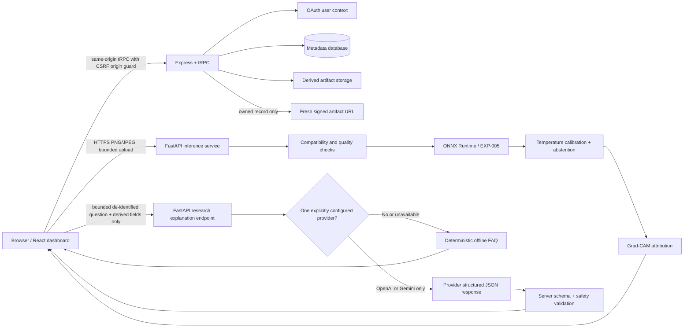
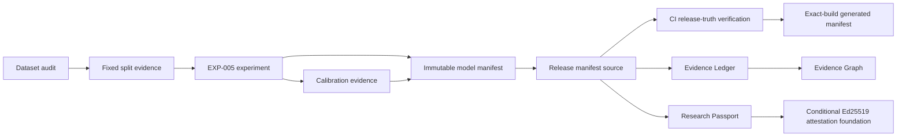
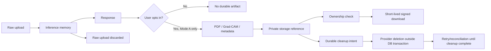

# NeuroInsight AI Architecture

NeuroInsight AI separates the public research dashboard, authentication-aware metadata service, independently deployed inference service, and a machine-readable evidence/release layer. **Mode A is the only available model path. Mode B is a disabled research roadmap, not a hidden service capability.**

## Runtime

Raw uploads are processed in memory and are not registered as history artifacts. Authenticated users may opt in to saving only returned Mode A metadata, reports, and real Grad-CAM outputs.

## Release truth and provenance layer

`release/release-manifest.template.json` is the machine-readable source for the declared academic release. `models/EXP-005/model-manifest.json` records the model contract, accepted evidence scope, calibration, runtime integrity strategy, promotion requirements, and explicit unsupported claims. `scripts/verify-release-truth.mjs` fails CI when core release declarations drift across the model registry, model card, capability manifest, Evidence Ledger, Evidence Graph, Passport implementation, migration history, or artifact-lifecycle architecture.

CI also generates an exact-build release manifest containing the source commit and package version. This improves traceability but does not create clinical validation or replace owner-managed deployment approval.

## Evidence Graph

The Evidence Graph exposes provenance relationships such as dataset → fixed split → EXP-005 → calibration/runtime → release manifest → Evidence Ledger/Research Passport. A node can remain `conditional` or `not_established`; graph connectivity never upgrades evidence and no aggregate trust score is produced.

The public-key Passport attestation primitive is intentionally `conditional`. The repository includes Ed25519 canonical-payload signing/verification and tamper-rejection tests, but no public signing endpoint is exposed until it can be bound to a verified server analysis receipt and a trusted public key can be distributed independently. This prevents an arbitrary client payload from becoming a misleading signed result.

## Reliability research tooling

The reliability engine accepts labeled top-confidence research evidence and computes:

- expected calibration error (ECE);
- top-label Brier evidence;
- Wilson 95% accuracy intervals;
- selective risk-coverage curves.

`pnpm research:reliability <input.json> [output.json]` generates a bounded machine-readable research evidence report. It does not claim multiclass Brier scoring without full class-probability vectors, robustness under distribution shift, conformal coverage, external validation, or clinical safety.

## Optional Research Explanation Assistant

The browser’s assistant request is bounded and allowlisted: question, language, purpose, fixed EXP-005 model version when present, predicted class, model-confidence score, calibration flag, manual-review flag, Grad-CAM availability, uncertainty reason, and `measurement_available=false`. It never sends raw MRI/DICOM/NIfTI bytes, previews, Grad-CAM binary/base64, filename, scan ID, account identity, email, signed URL, storage key, session token, or provider secret. The FastAPI endpoint rejects unsafe diagnosis/treatment and prompt-injection requests before any provider call; it sends a single configured provider a strict JSON-schema request, validates the response again server-side, and falls back to the deterministic offline FAQ on any uncertainty. The assistant cannot change a classifier output, bypass abstention, create a Mode B artifact, or activate Mode B.

## ML lifecycle

```mermaid
flowchart LR
  DS[Public dataset source] --> PA[Provenance + licence audit]
  PA --> DA[Hash / duplicate / leakage audit]
  DA --> SP[Documented split]
  SP --> TR[Training experiment]
  TR --> VA[Validation calibration]
  VA --> TE[Locked image-level test]
  TE --> MC[Experiment ledger + model card]
  MC --> MR[Model registry manifest]
  MR --> ON[ONNX export + checksum registry]
  ON --> DEP[Checksum-verified inference deployment]
```

EXP-005 is the deployed experimental Mode A classifier. Its held-out results are fixed-split **image-level** evidence only. EXP-006 was not promoted. No Mode B full-volume model or held-out segmentation evaluation is available.

A future model must not replace EXP-005 merely because a new checkpoint exists. Promotion requires audited provenance, predefined validation selection, locked-test evidence, calibration, runtime/ONNX integrity, release-truth updates, and a separate owner release decision.

## Privacy and artifact lifecycle

Deletion records cleanup responsibility durably before owned history metadata is removed. Provider I/O runs outside database transactions. Failed provider cleanup remains discoverable and retryable through the reconciliation worker. This architecture does not itself prove physical provider erasure; a real managed-provider exercise remains required before making that guarantee.

## Data invariants

`scan_records` is unique on `(userId, scanId)`, rather than globally trusting a client-supplied scan ID. `scan_artifacts` is unique on `(scanRecordId, artifactType)`. Foreign keys keep account and scan metadata referentially consistent. The history endpoint is ownership-scoped, cursor-bounded, newest-first, and returns artifacts in one batch rather than issuing an N+1 query. The complete artifact-lifecycle migration sequence is `0004 → 0005 → 0006`.

## Security boundaries

The dashboard disables Express fingerprinting, adds conservative security headers and a production CSP, requires a same-origin `Origin` for cookie-authenticated mutations, and exposes only ownership-scoped signed artifact URLs. The FastAPI service bounds uploads and pixels, validates decodes, limits public-demo bursts, sanitizes request IDs, restricts CORS to configured origins, supports shared abuse/replay controls when configured, and returns an explicit unavailable state instead of fabricating a prediction or segmentation output.

**This system is not a medical diagnosis and must not replace a qualified radiologist.**
