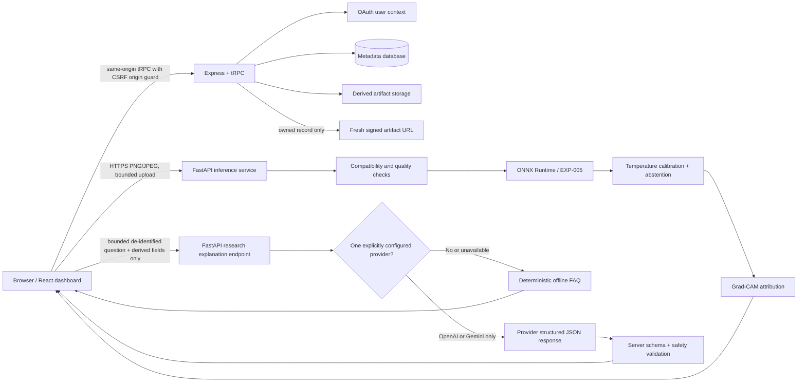
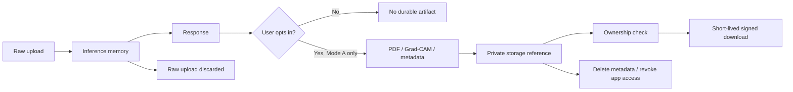

# NeuroInsight AI Architecture

NeuroInsight AI separates the public research dashboard, authentication-aware metadata service, and independently deployed inference service. **Mode A is the only available model path. Mode B is a disabled research roadmap, not a hidden service capability.**

## Runtime

Raw uploads are processed in memory and are not registered as history artifacts. Authenticated users may opt in to saving only returned Mode A metadata, reports, and real Grad-CAM outputs.

## Optional Research Explanation Assistant

The browser’s assistant request is bounded and allowlisted: question, language, purpose, fixed EXP-005 model version when present, predicted class, model-confidence score, calibration flag, manual-review flag, Grad-CAM availability, uncertainty reason, and `measurement_available=false`. It never sends raw MRI/DICOM/NIfTI bytes, previews, Grad-CAM binary/base64, filename, scan ID, account identity, email, signed URL, storage key, session token, or provider secret. The FastAPI endpoint rejects unsafe diagnosis/treatment and prompt-injection requests before any provider call; it sends a single configured provider a strict JSON-schema request, validates the response again server-side, and falls back to the deterministic offline FAQ on any uncertainty. The assistant cannot change a classifier output, bypass abstention, create a Mode B artifact, or activate Mode B.

## ML lifecycle

```mermaid
flowchart LR
  DS[Public dataset source] --> PA[Provenance + licence audit]
  PA --> DA[Hash / duplicate / leakage audit]
  DA --> SP[Documented split]
  SP --> TR[Training experiment]
  TR --> VA[Validation calibration]
  VA --> TE[Locked image-level test]
  TE --> MC[Experiment ledger + model card]
  MC --> ON[ONNX export + checksum registry]
  ON --> DEP[Checksum-verified inference deployment]
```

EXP-005 is the deployed experimental Mode A classifier. Its held-out results are fixed-split **image-level** evidence only. EXP-006 was not promoted. No Mode B full-volume model or held-out segmentation evaluation is available.

## Privacy and artifact lifecycle

Deletion revokes access through the application and removes metadata references. The configured helper does not prove provider-side physical object erasure; this is explicitly documented rather than overstated.

## Data invariants

`scan_records` is unique on `(userId, scanId)`, rather than globally trusting a client-supplied scan ID. `scan_artifacts` is unique on `(scanRecordId, artifactType)`. Foreign keys keep account and scan metadata referentially consistent. The history endpoint is ownership-scoped, cursor-bounded, newest-first, and returns artifacts in one batch rather than issuing an N+1 query.

## Security boundaries

The dashboard disables Express fingerprinting, adds conservative security headers and a production CSP, requires a same-origin `Origin` for cookie-authenticated mutations, and exposes only ownership-scoped signed artifact URLs. The FastAPI service bounds uploads and pixels, validates decodes, limits public-demo bursts per process, sanitizes request IDs, restricts CORS to configured origins, and returns an explicit unavailable state instead of fabricating a prediction or segmentation output.
